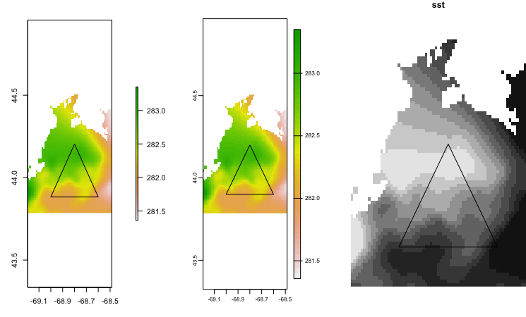
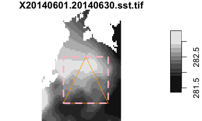
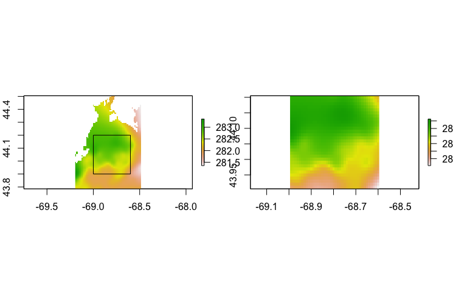
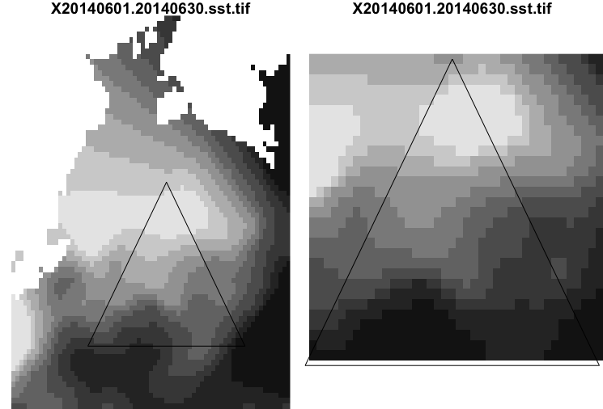
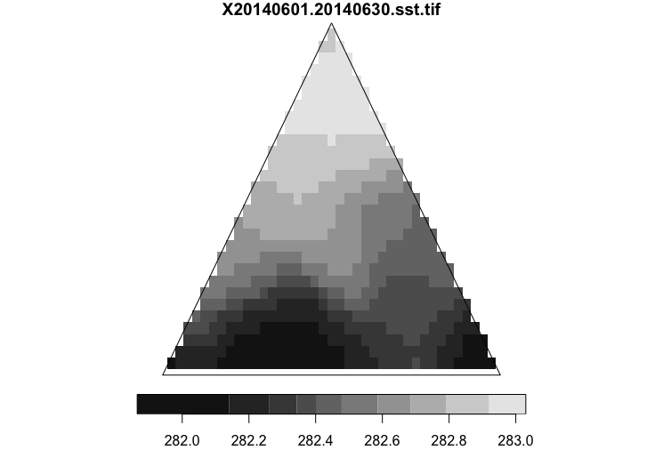

# Subsetting by cropping

Cropping is intended to extract a subset of a multidimensional array. Unlike slicing there is some expectation that the requested portion will not exactly match the actual portion. Some interpolation may be applied to match arbitrary bounding coordinates to crop with whole grid cell increments.

We will crop with multi-band `raster`, `terra` and `stars` objects. In addition we'll crop a multi-attribute multi-band `stars` object.

We'll use a provided polygon to define the bounding box we wich to crop.

```
source("setup.R")
rast <- read_stack(sst_file, form = "raster", apply_names = TRUE)
terr <- read_stack(sst_file, form = "terra", apply_names = TRUE)
star <- read_stack(sst_file, form = "stars", apply_names = TRUE)
mstar <- read_mstar()

poly <- sf::read_sf("data/penbay-polygon.gpkg")
```

First, let's look at the polygon relative to the first band in the first three objects. Note, that `stars` plotting method doesn't play well with others in the same device if it's color key is draw - to that is turned off.

```
opar <- par(no.readonly = TRUE)
par(mfrow = c(1,3))

plot(rast[[1]])
plot(poly, add = TRUE)

plot(terr[[1]])
plot(poly, add = TRUE)

plot(star[ , , , 1], key.pos = NULL, reset = FALSE)
plot(poly, add = TRUE)

par(opar)
```



### Bounding box

We can get a bounding box of the polygon pretty easily using `sf::st_bbox()`

```
bbox <- sf::st_bbox(poly)
bbox
#  xmin  ymin  xmax  ymax 
# -69.0  43.9 -68.6  44.2 

plot(star[ , , , 1], reset = FALSE)
plot(poly, add = TRUE, border = 'orange')
plot(sf::st_as_sfc(bbox), add = TRUE, lwd = 3, border = "pink", lty = 'dashed')
```



## Raster 

In this case we convert the bbox to a simple numeric vector and pass that to `raster::crop()`. They need to be in `[west, east, south, north]` order.

```
bb <- bbox[c("xmin", "xmax", "ymin", "ymax")]
crast <- raster::crop(rast, bb)

par(mfrow = c(1,2))
plot(rast[[1]])
plot(sf::st_as_sfc(bbox), add = TRUE)
plot(crast[[1]])
par(mfrow=c(1,1))
```


Keep in mind that the second argument to `raster::crop()` doesn't have to be a simple vector - some spatial objects are also accepted (such as other rasters, polygoons, *etc*.)

You might be wondering about the appearance of `sf::st_as_sfc()` in the above.  That function is casting the simple vector of bounding box corners to a geometric object - the same type that you find in the `geometery` column in a `sf` object.  But this is about rasters so never mind that.

## Terra

`terra::crop()` works much the same as raster with the exception that that object passed in must be castable to a `terra` "SpatExt" class.

```
cterr <- terra::crop(terr, ext(bb))
cterr
# class       : SpatRaster 
# dimensions  : 30, 40, 30  (nrow, ncol, nlyr)
# resolution  : 0.009999999, 0.01  (x, y)
# extent      : -68.995, -68.595, 43.905, 44.205  (xmin, xmax, ymin, ymax)
# coord. ref. : +proj=longlat +datum=WGS84 +no_defs 
# source      : memory 
# names       :  Jun_01,  Jun_02,  Jun_03,  Jun_04,  Jun_05,  Jun_06, ... 
# min values  : 281.816, 281.883, 282.141, 282.422, 282.754, 282.610, ... 
# max values  : 283.050, 282.808, 282.960, 283.478, 283.729, 283.999, ... 
```

## Stars

`stars` will crop is you subset with a spatial object.  

```
cstar <- star[st_as_sfc(bbox)]

par(mfrow = c(1,2))
plot(star[,,,1], reset = FALSE, key.pos = NULL)
plot(poly, add = TRUE)
plot(cstar[,,,1], reset = FALSE, key.pos = NULL)
plot(poly, add = TRUE)
```


Note that nearest whole pixels are cropped, which is evident in the right hand plot. In the `raster` and `terra` packages you have a bit of control using the `snap` argument to crop; it allows one to go 'in', 'out' or 'near' (default). I'm not sure if the same is available to `stars`, but if not a wrapper function might be added to give finer control.

# Stars bonus

`stars` will accept a non-rectangular polygon for cropping - and it will mask outside the polygon.

```
cstar <- star[poly]
plot(cstar[,,,1], reset = FALSE)
plot(poly, add = TRUE)
```
